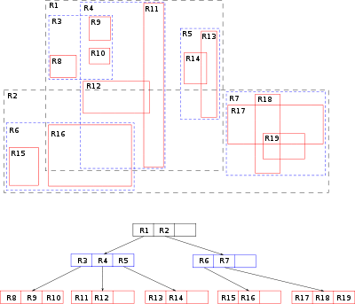

# Step 9. Optimize the Nearest. Use R-tree

In the last step, we wrote our own method, which returns the nearest drivers and it works slow. In this part, we will optimize it. To optimize it, we use R-tree

## R-tree


R-tree looks as shown in the picture. This is a tree-like data structure. It is good for understanding if you are familiar with the B-tree. R-tree is needed for indexing spatial data (coordinates, cities on the map). She also solves our problem. She can ask "Give me the 10 nearest drivers next to me." It's perfect for us.
[Learn More](https://ru.wikipedia.org/wiki/R-%D0%B4%D0%B5%D1%80%D0%B5%D0%B2%D0%BE_(%D1%81%D1%82%D1%80%D1%83%D0%BA%D1%82%D1%83%D1%80%D0%B0_%D0%B4%D0%B0%D0%BD%D0%BD%D1%8B%D1%85))

We will not do it ourselves, because there is already a ready implementation and we will take it from [here](https://github.com/dhconnelly/rtreego).


We install it
```
go get github.com/dhconnelly/rtreego
```

Introduce it in our storage
```Go
// DriverStorage is main storage for our project
type DriverStorage struct {
	drivers   map[int]*Driver
	locations *rtreego.Rtree
}

```
Well, now we need to adapt all our methods so that they work with Rtree.

We are starting with a building a spatial index, we need to know the boundary of a point. This can be done if we can build a minimal bounding box. What is it and for what, you can read [here](https://en.wikipedia.org/wiki/Minimum_bounding_rectangle)
R-tree takes the Spatial interface in our case, which must implement the Bounds() method, which must return a rectangle.

We will put instances of Driver in our storage. Therefore, we implement the Bounds() method

## Bounds()
```Go
// Bounds method needs for correct working of rtree
// Lat - Y, Lon - X on coordinate system
func (d *Driver) Bounds() *rtreego.Rect {
	return rtreego.Point{d.LastLocation.Lat, d.LastLocation.Lon}.ToRect(0.01)
}
```

## New
```Go
// New creates new instance of DriverStorage
func New() *DriverStorage {
	d := &DriverStorage{}
	d.drivers = make(map[int]*Driver)
	return d
}
```

## Set
```Go
// Set sets driver to storage by key
func (d *DriverStorage) Set(key int, driver *Driver) {
	_, ok := d.drivers[key]
	if !ok {
		d.locations.Insert(driver)
	}
	d.drivers[key] = driver
}

```

## Delete
```Go
// Delete removes driver from storage by key
func (d *DriverStorage) Delete(key int) error {

	driver, ok := d.drivers[key]
	if !ok {
		return errors.New("driver does not exist")
	}
	if d.locations.Delete(driver) {
		delete(d.drivers, key)
		return nil
	}
	return errors.New("could not remove driver")
}


```
Now we need to adapt the Nearest() method. Judging by the [ documentation](https://godoc.org/github.com/dhconnelly/rtreego), there is a method NearestNeighbors(), which needs to transfer the number of elements that need to be returned as the nearest ones. This method also does not have a radius. Therefore, the Nearest() method will look like this
```Go
// Nearest returns nearest drivers by locaion
func (d *DriverStorage) Nearest(count int, lat, lon float64) []*Driver {
	point := rtreego.Point{lat, lon}
	results := d.locations.NearestNeighbors(count, point)
	var drivers []*Driver
	for _, item := range results {
		if item == nil {
			continue
		}
		drivers = append(drivers, item.(*Driver))
	}
	return drivers
}
```
And the test for it will be corrected
```Go
func TestNearest(t *testing.T) {
	s := New()
	s.Set(123, &Driver{
		ID: 123,
		LastLocation: Location{
			Lat: 1,
			Lon: 1,
		},
	})
	s.Set(666, &Driver{
		ID: 666,
		LastLocation: Location{
			Lat: 42.875799,
			Lon: 74.588279,
		},
	})
	drivers := s.Nearest(1, 42.876420, 74.588332)
	assert.Equal(t, len(drivers), 1)
}
```

Let us adapt our benchmark
```Go
func BenchmarkNearest(b *testing.B) {
	s := New()
	for i := 0; i < 100; i++ {
		s.Set(i, &Driver{
			ID: i,
			LastLocation: Location{
				Lat: float64(i),
				Lon: float64(i),
			},
		})
	}
	for i := 0; i < b.N; i++ {
		s.Nearest(10, 123, 123)
	}
}
```
And check it for 100, 1000 and 10,000 elements
```
BenchmarkNearest-4        200000              6649 ns/op
PASS
ok      github.com/maddevsio/gocodelabru/step10/storage 1.418s
```
1000
```
 go test -bench=.
BenchmarkNearest-4         20000             76832 ns/op
PASS
ok      github.com/maddevsio/gocodelabru/step10/storage 1.745s
```
10000
```Go
BenchmarkNearest-4          5000            210245 ns/op
PASS
ok      github.com/maddevsio/gocodelabru/step10/storage 9.951s
```

Well, as you can see, work has become faster.

## Congratulations!
You learned what is R-tree and implemented it into the project. In the [next](../step10/README.md) part, we begin to solve the problem with storing the last few coordinates.